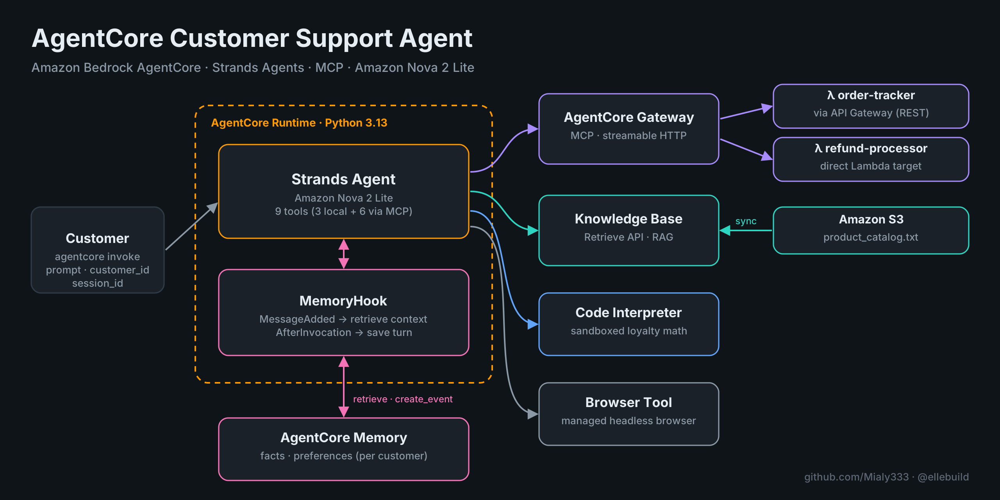
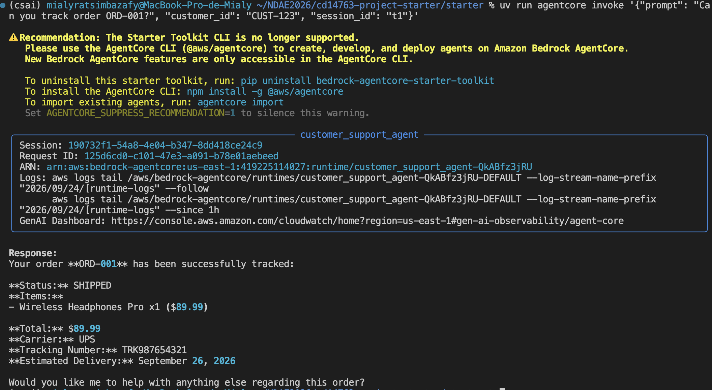
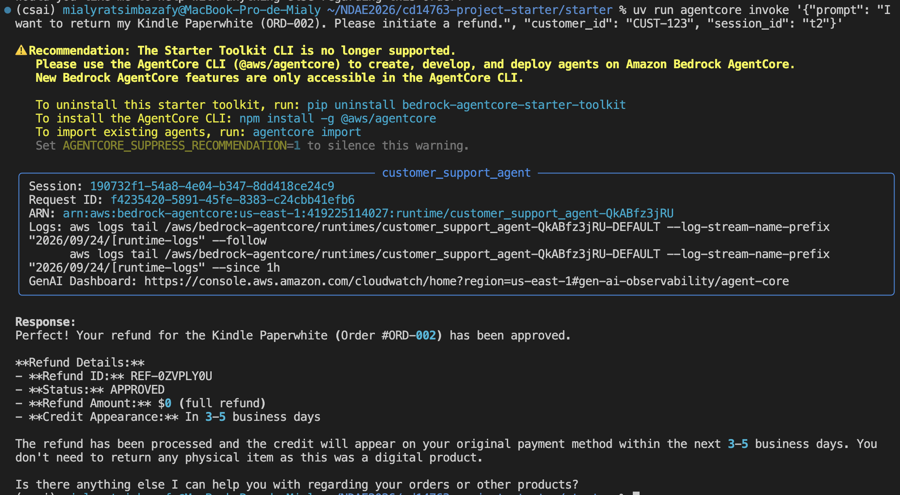
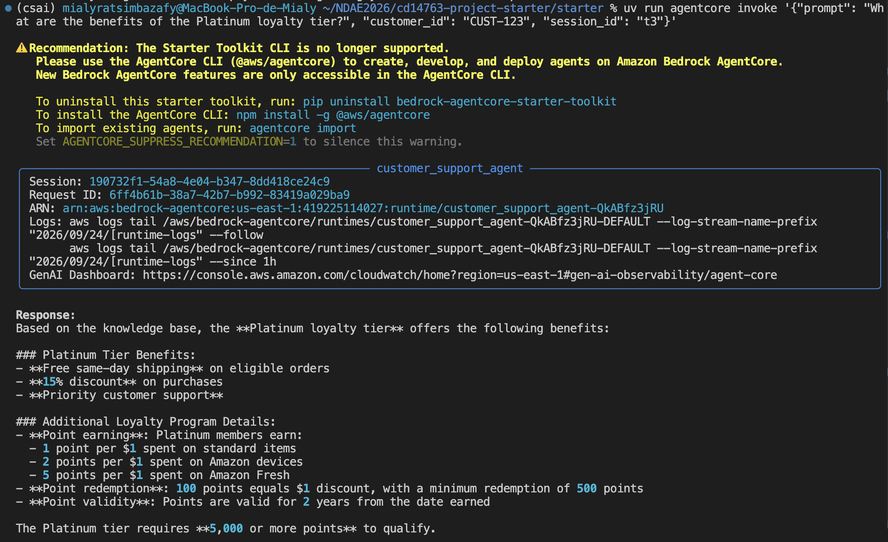
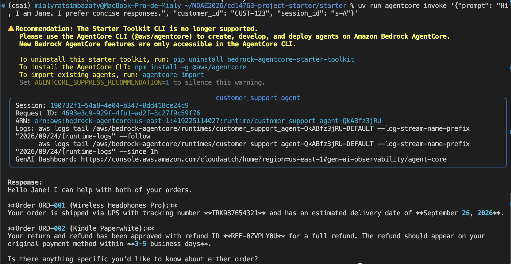
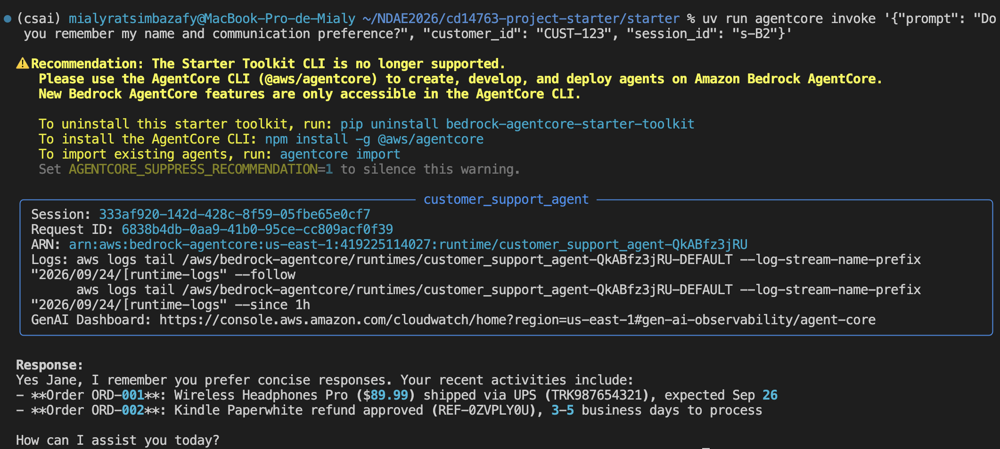
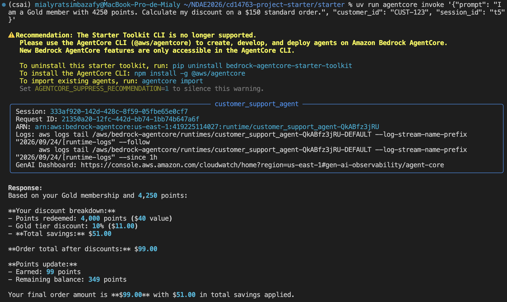
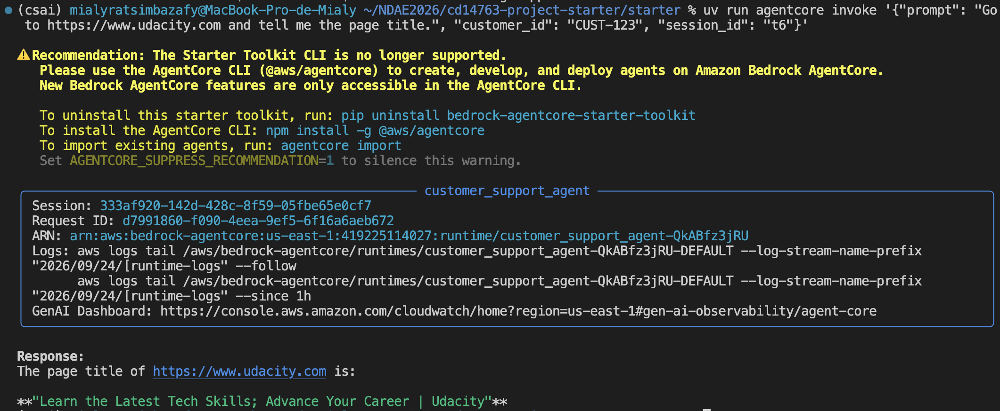
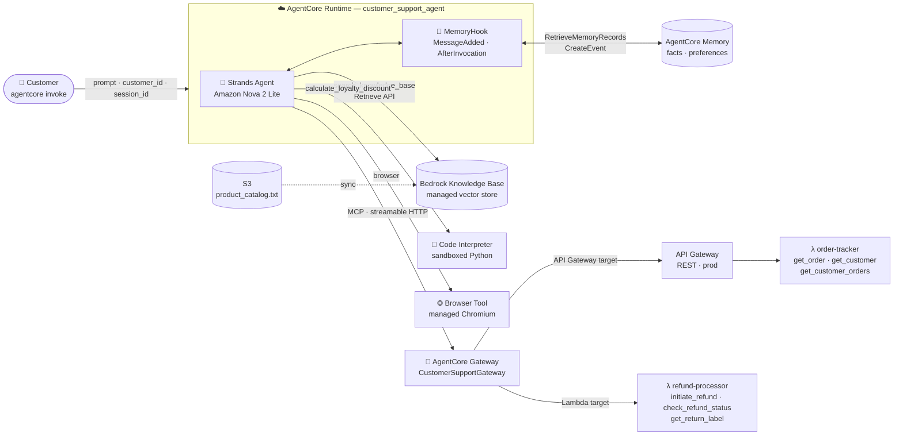
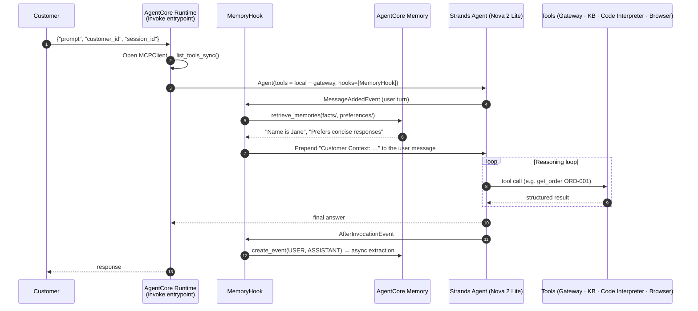

<div align="center">

# 🛎️ AgentCore Customer Support Agent

**A production-pattern AI customer support agent on Amazon Bedrock AgentCore** —
tracks orders, issues refunds, answers policy questions from a knowledge base,
remembers customers across sessions, does exact loyalty math in a sandbox, and browses the live web.


*Built by [Mialy Ratsimbazafy](https://github.com/Mialy333) (@ellebuild) · AWS AI & ML Scholars — Future Agent Engineer, Project #2 (Udacity)*

</div>

<p align="center"></p>

---

## Table of contents

- [What it does](#what-it-does)
- [Demo — the six test scenarios](#demo--the-six-test-scenarios)
- [Architecture](#architecture)
- [How a request flows](#how-a-request-flows)
- [Implementation highlights](#implementation-highlights)
- [Repository structure](#repository-structure)
- [Run it yourself](#run-it-yourself)
- [Lessons learned](#lessons-learned)
- [Cleanup (do not skip)](#cleanup-do-not-skip)
- [Credits & license](#credits--license)

---

## What it does

One conversational entrypoint, six AgentCore capabilities working together:

| Capability | AgentCore building block | What the customer gets |
|---|---|---|
| 📦 **Order tracking** | **Gateway** (MCP) → API Gateway → Lambda `order-tracker` | Status, carrier, tracking number, ETA |
| 💸 **Refunds & returns** | **Gateway** (MCP) → Lambda `refund-processor` | Refund ID, approval status, return label |
| 📚 **Product & policy answers** | **Bedrock Knowledge Base** (RAG, `Retrieve` API) | Grounded answers on specs, warranties, return windows, loyalty tiers |
| 🧠 **Cross-session memory** | **AgentCore Memory** (semantic + user-preference strategies) via a Strands hook | "Welcome back, Jane" — remembers name, preferences, past orders |
| 🧮 **Loyalty discount math** | **Code Interpreter** (sandboxed Python) | Exact points redemption, tier discount, final total |
| 🌐 **Live web lookups** | **Browser Tool** (managed headless browser) | Real-time information from any public page |

Everything runs on **AgentCore Runtime** (serverless, direct code deploy, Python 3.13) with **Amazon Nova 2 Lite** as the reasoning model.

---

## Demo — the six test scenarios

All six scenarios were run against the **deployed** runtime with `agentcore invoke`.

| # | Scenario | Prompt | Result |
|---|---|---|---|
| 1 | Order tracking | *Can you track order ORD-001?* | ✅ SHIPPED · UPS · `TRK987654321` · ETA |
| 2 | Refund processing | *I want to return my Kindle Paperwhite (ORD-002)…* | ✅ `REF-0ZVPLY0U` · APPROVED · 3–5 business days — ⚠️ amount bug, see [Lessons learned](#lessons-learned) |
| 3 | Knowledge Base (RAG) | *What are the benefits of the Platinum loyalty tier?* | ✅ Same-day shipping · 15% · priority support |
| 4 | Long-term memory | Session A: *Hi, I am Jane. I prefer concise responses.* → Session B: *Do you remember me?* | ✅ Recalls **Jane** + **concise** across sessions |
| 5 | Loyalty discount | *Gold member, 4,250 points, $150 standard order* | ✅ 4,000 pts redeemed · 10% tier · **$99.00** final · 349 pts left |
| 6 | Browser | *Go to udacity.com and tell me the page title* | ✅ Live page title retrieved |

<details>
<summary><b>📸 Test 1 — Order tracking (Gateway → API Gateway → Lambda)</b></summary>


</details>

<details>
<summary><b>📸 Test 2 — Refund processing (Gateway → Lambda target)</b></summary>


</details>

<details>
<summary><b>📸 Test 3 — Knowledge Base (RAG)</b></summary>


</details>

<details open>
<summary><b>📸 Test 4 — Long-term memory across two sessions</b></summary>

Session A — the customer introduces herself:



Session B — a brand-new session, same customer. The agent recalls her name, her preference, *and* her recent orders:


</details>

<details>
<summary><b>📸 Test 5 — Loyalty discount (Code Interpreter)</b></summary>



The math checks out: 4,250 pts → 4,000 redeemable (500-pt blocks) = **$40** → $110 subtotal → Gold 10% = **$11** → **$99.00** final → earns 99 pts → 250 + 99 = **349** pts remaining.
</details>

<details>
<summary><b>📸 Test 6 — Browser tool</b></summary>


</details>

---

## Architecture



**Nine tools reach the model** — 3 local (`search_knowledge_base`, `calculate_loyalty_discount`, `browser`) and 6 discovered at runtime from the Gateway over MCP. The agent never knows which backend sits behind a tool; it only sees an MCP tool list.

---

## How a request flows



Long-term extraction is **asynchronous**: AgentCore Memory turns raw events into facts and preferences in the background, which is why the test waits ~30 s between Session A and Session B.

---

## Implementation highlights

All agent logic lives in [`starter/main.py`](starter/main.py).

**🧠 Memory as a hook, not a prompt rebuild.** `MemoryHook` implements Strands' `HookProvider`. On `MessageAddedEvent` it queries every memory namespace (`cs_agent/{actorId}/facts`, `cs_agent/{actorId}/preferences`) and prepends a `Customer Context:` block to the user's message; on `AfterInvocationEvent` it saves the (user, assistant) pair with `create_event`. Tool-result messages are skipped, so memory is only queried on real user turns. Namespaces are discovered from the memory's strategies (`namespaceTemplates[0]`, falling back to the legacy `namespaces[0]`), so nothing is hard-coded twice.

**🔌 Tools through one MCP endpoint.** The Gateway exposes two very different backends — an API Gateway REST API (proxy integration) and a direct Lambda target that reads the tool name from `context.client_context` — as a single MCP server. `MCPClient(lambda: streamable_http_client(GATEWAY_URL))` loads them at invocation time.

**📚 Grounded answers.** `search_knowledge_base` calls the `bedrock-agent-runtime` `Retrieve` API and joins chunks with `\n---\n`, so policy and loyalty answers come from the catalog, not from the model's priors.

**🧮 Arithmetic the model doesn't do.** `calculate_loyalty_discount` generates a small Python program (500-point redemption blocks, 50% order cap, tier rates, category earn rates) and runs it in the Code Interpreter. If the sandbox is unavailable, it degrades to a tier-only fallback and says so in the result.

**🔍 Traceable tool calls.** After each turn, every `toolUse` / `toolResult` is logged to CloudWatch with name, input and status — so a reviewer can verify which backend actually answered.

**🔐 Least-privilege runtime role.** [`setup_permissions.py`](starter/setup_permissions.py) reads the resource IDs from `main.py` *as text* (via `ast`, never importing the agent), validates them, checks the account/role match the deployment, and attaches one inline policy scoped to this KB, this memory and the managed browser.

---

## Repository structure

```
.
├── README.md
├── LICENSE.txt                     ← Udacity educational license (starter code)
├── docs/
│   └── screenshots/
│       ├── tests/                  ← the six functional tests (deployed runtime)
│       └── setup/                  ← step-by-step AWS console & CLI setup
└── starter/
    ├── main.py                     ← the agent: tools, MemoryHook, entrypoint
    ├── setup_permissions.py        ← scoped IAM inline policy for the runtime role
    ├── product_catalog.txt         ← Knowledge Base source document
    ├── REFLECTION.md               ← design decision · challenge · production notes
    ├── pyproject.toml / uv.lock    ← dependencies (uv, Python 3.13)
    └── lambda/
        ├── order_tracker.py        ← API Gateway proxy Lambda (orders, customers)
        ├── refund_processor.py     ← direct Gateway Lambda (refunds, labels)
        └── lambda_schema           ← MCP tool schema for the refund target
```

---

## Run it yourself

<details>
<summary><b>Prerequisites</b></summary>

- AWS account in **us-east-1** with access to Lambda, API Gateway, S3, Bedrock Knowledge Bases and AgentCore (Runtime, Gateway, Memory, Code Interpreter, Browser)
- Model access to **Amazon Nova 2 Lite** (invoked as `global.amazon.nova-2-lite-v1:0`)
- Python 3.13, [uv](https://docs.astral.sh/uv/), AWS CLI v2, Node 18+ (for MCP Inspector)
- The Python **Bedrock AgentCore Starter Toolkit** CLI. ⚠️ Don't install it alongside the newer npm `@aws/agentcore` CLI — both ship an `agentcore` binary.
</details>

### 1 · Backend tools (Lambda + API Gateway + AgentCore Gateway)

1. Create two Lambda functions (Python 3.12) from `starter/lambda/`: `order-tracker`, `refund-processor`.
2. Create a REST API with `GET /orders/{order_id}`, `GET /customers/{customer_id}`, `GET /customers/{customer_id}/orders` — all **Lambda proxy** to `order-tracker` — and deploy it to a `prod` stage.
3. Create an AgentCore Gateway (`CustomerSupportGateway`, inbound auth **NONE** — sandbox only) with two targets:
   - API Gateway target → your REST API `prod` stage (operations `get_order`, `get_customer`, `get_customer_orders`)
   - Lambda target → `refund-processor`, schema from `starter/lambda/lambda_schema`, outbound auth IAM role
   - ⚠️ Target names must match `([0-9a-zA-Z][-]?){1,100}` — **use hyphens, not underscores** (`order-tracker`, `refund-processor`).
4. Verify with `npx @modelcontextprotocol/inspector` — six tools should be listed.

### 2 · Knowledge Base

Upload `starter/product_catalog.txt` to S3 → create a **Managed Knowledge Base** (`CustomerSupportKB`) with that bucket as data source → **Sync**.

### 3 · Memory

Create `CustomerSupportMemory` with two built-in strategies:

| Strategy | Name | Namespace |
|---|---|---|
| Semantic | `customer_facts` | `cs_agent/{actorId}/facts` |
| User preference | `customer_preferences` | `cs_agent/{actorId}/preferences` |

Wait until it is **ACTIVE**.

### 4 · Configure, deploy, grant permissions

Put your `GATEWAY_URL`, `KB_ID`, `REGION`, `MEMORY_ID` (literal strings) at the top of `starter/main.py`, then:

```bash
cd starter
uv sync --python 3.13

uv run agentcore configure --entrypoint main.py --name customer_support_agent \
  --deployment-type direct_code_deploy --runtime PYTHON_3_13 --disable-memory
uv run agentcore deploy
uv run setup_permissions.py        # add --dry-run to preview the policy
```

> `--disable-memory` only stops the toolkit from creating its *own* memory — the agent uses the one from step 3.
> Double-check the region in the `configure` summary: it must match `REGION` in `main.py`.

### 5 · Test

```bash
uv run agentcore invoke '{"prompt": "Can you track order ORD-001?", "customer_id": "CUST-123", "session_id": "t1"}'
uv run agentcore invoke '{"prompt": "I want to return my Kindle Paperwhite (ORD-002). Please initiate a refund.", "customer_id": "CUST-123", "session_id": "t2"}'
uv run agentcore invoke '{"prompt": "What are the benefits of the Platinum loyalty tier?", "customer_id": "CUST-123", "session_id": "t3"}'
uv run agentcore invoke '{"prompt": "Hi, I am Jane. I prefer concise responses.", "customer_id": "CUST-123", "session_id": "s-A"}'
sleep 30
uv run agentcore invoke '{"prompt": "Do you remember my name and communication preference?", "customer_id": "CUST-123", "session_id": "s-B"}'
uv run agentcore invoke '{"prompt": "I am a Gold member with 4250 points. Calculate my discount on a $150 standard order.", "customer_id": "CUST-123", "session_id": "t5"}'
uv run agentcore invoke '{"prompt": "Go to https://www.udacity.com and tell me the page title.", "customer_id": "CUST-123", "session_id": "t6"}'
```

<details>
<summary><b>📸 Full setup walkthrough (43 console & CLI screenshots)</b></summary>

| Step | Screenshots |
|---|---|
| API Gateway | [resource](docs/screenshots/setup/01-api-gateway-create-resource.png) · [prod stage](docs/screenshots/setup/02-api-gateway-prod-stage.png) · [deployment](docs/screenshots/setup/03-api-gateway-deployment.png) |
| AgentCore Gateway | [home](docs/screenshots/setup/04-agentcore-gateways-home.png) · [add target](docs/screenshots/setup/05-gateway-add-target.png) · [target types](docs/screenshots/setup/06-gateway-target-types.png) · [order-tracker](docs/screenshots/setup/07-gateway-target-order-tracker.png) · [API operations](docs/screenshots/setup/08-gateway-api-operations.png) · [review](docs/screenshots/setup/09-gateway-review-one-target.png) · [refund-processor](docs/screenshots/setup/10-gateway-target-refund-processor.png) · [inline schema](docs/screenshots/setup/11-gateway-refund-inline-schema.png) · [outbound IAM](docs/screenshots/setup/12-gateway-refund-outbound-iam.png) · [review 2 targets](docs/screenshots/setup/13-gateway-review-two-targets.png) · [⚠️ name validation error](docs/screenshots/setup/14-gateway-target-name-validation-error.png) · [target created](docs/screenshots/setup/15-gateway-refund-target-created.png) · [targets ready](docs/screenshots/setup/16-gateway-targets-ready.png) · [details](docs/screenshots/setup/38-gateway-details.png) |
| Memory | [strategies](docs/screenshots/setup/17-memory-strategies-empty.png) · [configured](docs/screenshots/setup/18-memory-strategies-configured.png) · [semantic](docs/screenshots/setup/19-memory-semantic-strategy.png) · [user preference](docs/screenshots/setup/20-memory-user-preference-strategy.png) · [created](docs/screenshots/setup/21-memory-created.png) · [creating](docs/screenshots/setup/22-memory-strategies-creating.png) · [active](docs/screenshots/setup/23-memory-active.png) · [strategies active](docs/screenshots/setup/24-memory-strategies-active.png) |
| S3 | [bucket](docs/screenshots/setup/25-s3-create-bucket.png) · [ownership](docs/screenshots/setup/26-s3-object-ownership.png) · [versioning & encryption](docs/screenshots/setup/27-s3-versioning-encryption.png) · [advanced](docs/screenshots/setup/28-s3-advanced-settings.png) · [upload catalog](docs/screenshots/setup/29-s3-upload-catalog.png) |
| Knowledge Base | [create](docs/screenshots/setup/30-kb-create-managed.png) · [data source](docs/screenshots/setup/31-kb-data-source.png) · [parsing & chunking](docs/screenshots/setup/32-kb-parsing-chunking.png) · [S3 URI](docs/screenshots/setup/33-kb-data-source-s3-uri.png) · [syncing](docs/screenshots/setup/34-kb-syncing.png) · [sync complete](docs/screenshots/setup/35-kb-sync-complete.png) |
| Runtime | [local run](docs/screenshots/setup/36-local-run.png) · [configure](docs/screenshots/setup/39-agentcore-configure-prompts.png) · [⚠️ wrong region](docs/screenshots/setup/40-agentcore-configure-wrong-region.png) · [us-east-1](docs/screenshots/setup/41-agentcore-configure-us-east-1.png) · [deploy](docs/screenshots/setup/42-agentcore-deploy-success.png) · [permissions](docs/screenshots/setup/43-setup-permissions.png) · [redeploy](docs/screenshots/setup/44-agentcore-redeploy.png) |
</details>

---

## Lessons learned

- **The model's own guardrails can misfire.** In the memory test, the agent recalled "prefers concise responses" but *refused to say the customer's name back*, calling it personal data — even though she had shared it herself. Nothing in the code blocked it. The fix was in the system prompt: state explicitly that the `Customer Context` block holds facts the customer volunteered and that repeating them back is expected. Sometimes prompt engineering means *removing* caution.
- **Passing a test ≠ correct behavior.** Test 2 shows `APPROVED` and "3–5 business days" as expected — but the refund went out with **`amount: $0`**, because `amount` is optional in the tool schema and the model never called `get_order` to fetch the $139.99 total first. It then improvised "this was a digital product, no return needed". Fixes for v2: make `amount` required (or have the Lambda look it up server-side), and tell the agent to read the order before acting on it.
- **Gateway target names reject underscores.** `order_tracker` fails validation; `order-tracker` works. The error only surfaces after the Gateway itself is created.
- **Region drift is silent until it isn't.** `agentcore configure` once picked up `us-west-2` while every resource lived in `us-east-1`. Read the configuration summary before deploying.
- **Memory extraction is eventual.** Session B only sees Session A's facts after the background extraction runs (~30 s).
- **Toolkit churn.** The Python Starter Toolkit now prints a deprecation notice in favor of the npm `@aws/agentcore` CLI; this project intentionally stays on the Python toolkit.

**Production next steps:** a real authorizer on the Gateway (JWT/OAuth instead of NONE), retries and timeouts on the MCP connection, tighter IAM than the auto-created runtime role, and cost monitoring on the vector store. More in [`REFLECTION.md`](starter/REFLECTION.md).

---

## Cleanup (do not skip)

The vector store behind the Knowledge Base can keep billing whether you're testing or not.

1. `uv run agentcore destroy`
2. Bedrock console → AgentCore → delete the **Gateway** and the **Memory**; delete the **Knowledge Base**
3. Delete the **OpenSearch Serverless** collection (if one was created) and empty + delete the **S3 bucket**
4. Delete the **API Gateway** REST API and both **Lambda** functions
5. *(Optional)* Delete the auto-created IAM roles

---

## Credits & license

- Project brief, starter scaffolding and Lambda functions: **Udacity** — *AWS AI & ML Scholars, Future Agent Engineer* track (course `cd14763`), distributed under the Udacity educational license in [`LICENSE.txt`](LICENSE.txt).
- Agent implementation (`main.py` TODO sections), deployment, testing, documentation: **Mialy Ratsimbazafy**.
- Built with [Amazon Bedrock AgentCore](https://docs.aws.amazon.com/bedrock-agentcore/latest/devguide/what-is-bedrock-agentcore.html), [Strands Agents](https://strandsagents.com) and the [Model Context Protocol](https://modelcontextprotocol.io).

The Gateway URL and resource IDs in `main.py` point to sandbox resources that have been (or must be) torn down — they are kept only so the reviewed submission stays intact.
